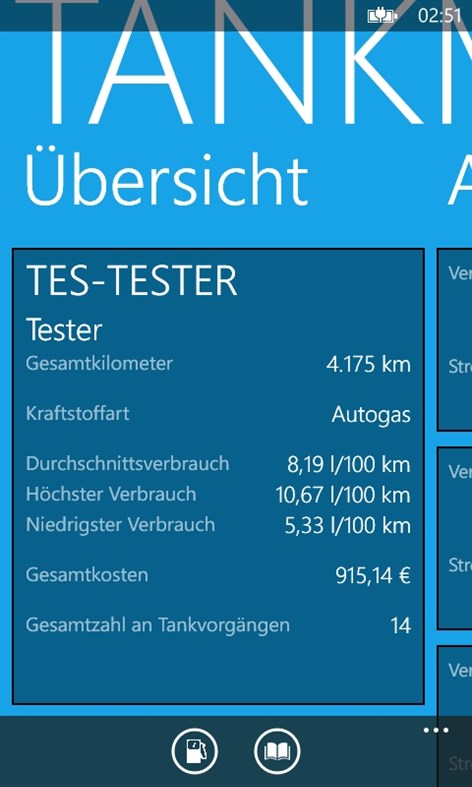
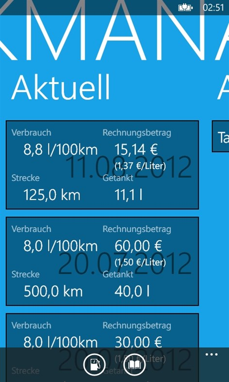
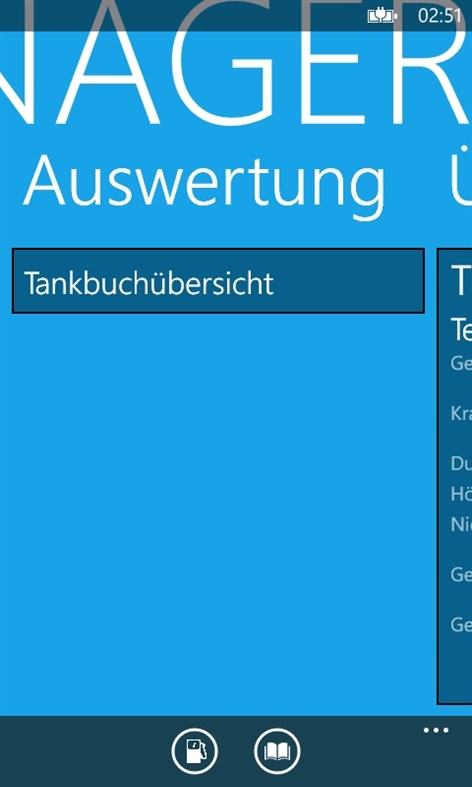
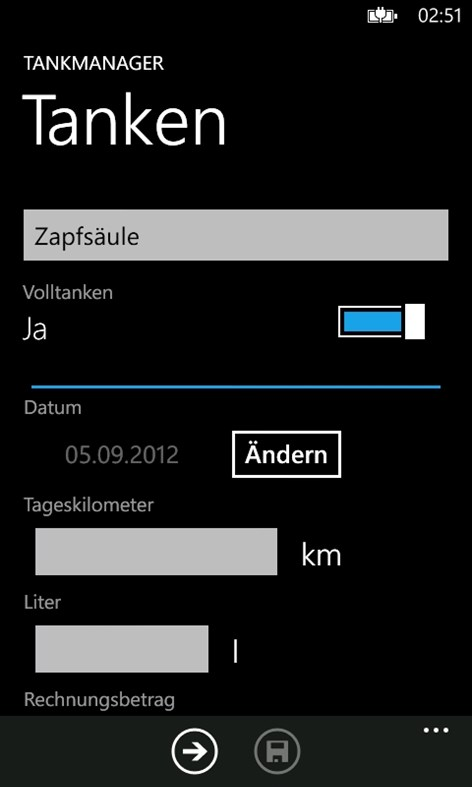
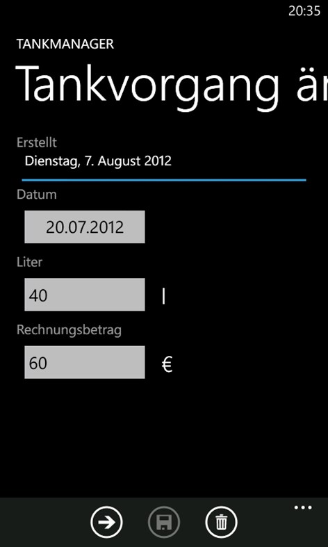
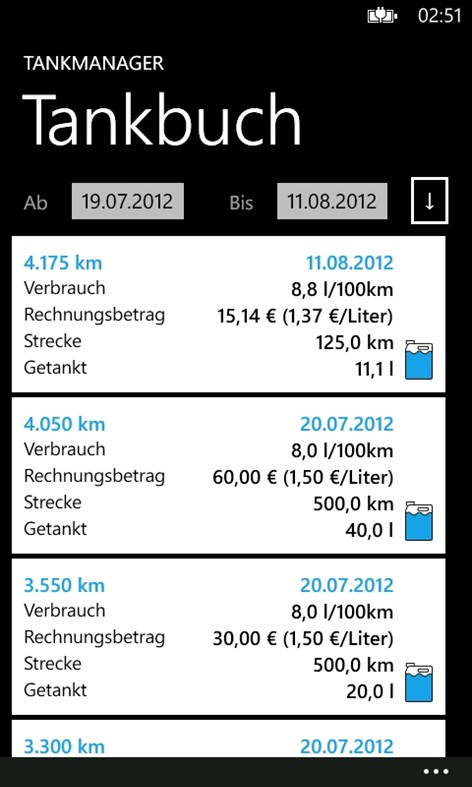
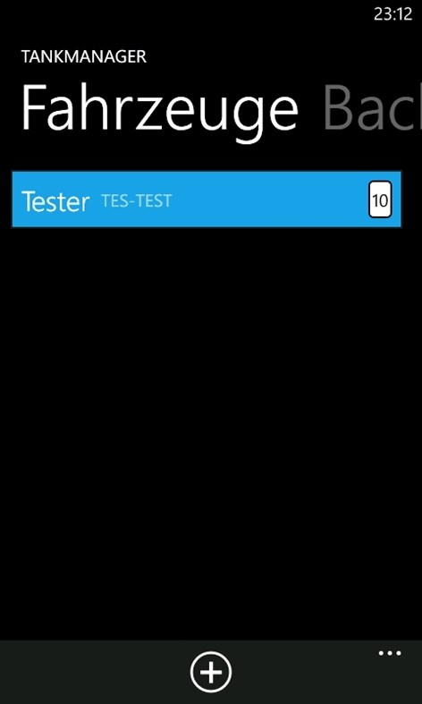
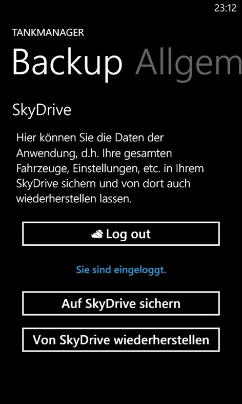

**Discontinued**

# TankManager for Windows Phone 7

<a href="https://gitlab.com/philipp.schweig/TankManager">
 GitLab repository (official)
<a/>
|
<a href="https://github.com/philippschweig/TankManager">
 GitHub repository (mirror)
<a/>
  

TankManager was an application for the mobile operating system Microsoft Windows Phone 7 for calculating the consumption of road vehicles.

[German store link](https://www.microsoft.com/de-de/p/tankmanager/9wzdncrdchwq?activetab=pivot:overviewtab)

This is the source code of the application.

Because the operating system was discontinued, this application is also discontinued.

> The source code does not compile currently!

## Screenshots

